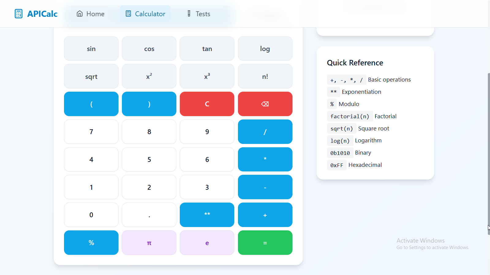

# Advanced Precision Integer Calculator

## Problem Statement

Write an arbitrary-precision-integer calculator in a language that doesn't have native support and without relying on any libraries for the core functionality. Wrap it in a REPL. It should support at least addition, subtraction, multiplication, division (and modulo), exponentiation and factorial. Bonus points for supporting non-decimal bases, fractions, logarithms, etc.

## Overview

An arbitrary-precision integer calculator implemented in Python without relying on external libraries for core mathematical operations. This calculator supports multiple number bases, advanced mathematical functions, and provides both a comprehensive REPL interface and a modern web-based frontend.

The project includes:
- **Python Core Engine**: Full-featured arbitrary precision calculator with REPL
- **React Frontend**: Modern web interface with TypeScript
- **Dual Implementation**: Both Python backend API and JavaScript frontend calculator
- **Complete Integration**: Works offline and online

Here's what the dashboard looks like:

🌐 **Live Demo**: https://apicalculator-v1.netlify.app/

## Architecture

### Backend (Python)
- **Core Engine**: `APICalc.py` - Pure Python implementation with arbitrary precision
- **REPL Interface**: Command-line interface for direct calculator interaction
- **API Server**: `api_server.py` - Flask-based REST API (optional)
- **Test Suite**: `test_APICalc.py` - Comprehensive testing framework

### Frontend (React + TypeScript)
- **Modern Web Interface**: Built with React, TypeScript, and Tailwind CSS
- **Calculator Page**: Interactive calculator with visual button interface
- **Test Interface**: Web-based test runner for validation
- **Responsive Design**: Works seamlessly across desktop and mobile devices
- **Dual Calculator**: JavaScript implementation for offline use + API integration

### Deployment Options
1. **Static Site** (Netlify): Uses embedded JavaScript calculator
2. **Full Stack** (Local): Python API + React frontend
3. **Hybrid**: Python CLI + JavaScript web interface

## Features

### Core Arithmetic Operations
- **Addition** (`+`): Add two numbers
- **Subtraction** (`-`): Subtract two numbers  
- **Multiplication** (`*`): Multiply two numbers
- **Division** (`/`): Divide two numbers with arbitrary precision
- **Floor Division** (`//`): Integer division
- **Modulo** (`%`): Remainder operation
- **Exponentiation** (`**`): Raise to power

### Advanced Mathematical Functions
- **Factorial** (`factorial(n)` or `n!`): Calculate factorial
- **Square Root** (`sqrt(n)`): Calculate square root
- **Square** (`sqr(n)`): Calculate square (n²)
- **Cube** (`cube(n)`): Calculate cube (n³)
- **Cube Root** (`cube_root(n)`): Calculate cube root
- **Logarithm** (`log(n)` or `log(n, base)`): Natural or base logarithm
- **Exponential** (`exp(n)`): Calculate e^n
- **Inverse** (`inverse(n)`): Calculate 1/n

### Trigonometric Functions
- **Sine** (`sin(x)`): Calculate sine
- **Cosine** (`cos(x)`): Calculate cosine
- **Tangent** (`tan(x)`): Calculate tangent
- **Arcsine** (`arcsin(x)`): Calculate inverse sine
- **Arccosine** (`arccos(x)`): Calculate inverse cosine
- **Arctangent** (`arctan(x)`): Calculate inverse tangent

### Number Base Support
- **Binary** (`0b1010`): Base-2 numbers
- **Octal** (`0o17`): Base-8 numbers
- **Decimal** (default): Base-10 numbers
- **Hexadecimal** (`0xFF`): Base-16 numbers
- **Custom Bases**: Support for bases 2-36

### Fraction Support
- **Fraction Conversion** (`to_fraction()`): Convert to fraction representation
- **Fraction Input**: Initialize with fraction values
- **Fraction Arithmetic**: Perform operations on fractions

## Usage

### 🌐 Online Demo (Recommended)

Visit **https://apicalculator-v1.netlify.app/** to use the calculator immediately - no installation required!

### 💻 Local Development

#### Option 1: Frontend Only (Static)

1. **Install dependencies:**
   ```bash
   npm install
   ```

2. **Start the development server:**
   ```bash
   npm run dev
   ```

3. **Navigate to the application:**
   - **Home Page**: Overview and navigation
   - **Calculator**: Interactive calculator interface
   - **Tests**: Web-based test runner

#### Option 2: Full Stack (API + Frontend)

1. **Start both servers simultaneously:**
   ```bash
   # Windows
   .\start_local.bat
   
   # Or manually:
   # Terminal 1: python api_server.py
   # Terminal 2: npm run dev
   ```

#### Option 3: Python CLI Only

```bash
python APICalc.py
```

**REPL Commands:**
- `menu` - Show help menu with all available operations
- `history` - Display calculation history (last 10 calculations)
- `clear` - Clear calculation history
- `quit` or `exit` - Exit the calculator

### Example Usage

#### Web Interface
- Use the visual calculator buttons for easy input
- Type expressions directly in the input field
- View calculation history in the sidebar
- Copy results to clipboard with one click

Here's how the calculator interface looks:



#### Command Line
```
>>> 123 + 456
579

>>> factorial(5)
120

>>> sqrt(16)
4.0

>>> 0b1010 + 0x10
0b11010

>>> sin(3.14159/2)
0.9999999999999999

>>> log(100, 10)
2.0

>>> to_fraction(0.75)
3/4
```

### Advanced Examples

```
>>> 2 ** 100
1267650600228229401496703205376

>>> factorial(20)
2432902008176640000

>>> 0xFF * 0b1010
0xa0a

>>> sqrt(2) ** 2
2.0000000000000004
```

## Implementation Details

### Calculator Implementations

#### Python Core (`APICalc.py`)
- **Precision Modes**: Standard (50 digits), High (200 digits), Extreme (1000 digits)
- **Algorithms**: Karatsuba multiplication, Newton-Raphson division, binary exponentiation
- **Features**: Full arbitrary precision, all mathematical functions

#### JavaScript Frontend (`src/utils/calculator.ts`)
- **Precision**: JavaScript number precision (sufficient for most use cases)
- **Features**: Basic arithmetic, factorial, square root, base conversion
- **Benefits**: Offline operation, instant response, no server required

### Integration Architecture

#### Static Deployment (Netlify)
- Uses JavaScript calculator for all operations
- No backend server required
- Works offline after initial load
- Instant calculations

#### Full Stack Deployment
- Python API server provides full arbitrary precision
- React frontend calls API endpoints
- Supports all advanced mathematical functions
- Requires server infrastructure

### Error Handling
- Division by zero protection
- Invalid input validation
- Precision loss warnings (Python only)
- Domain validation for mathematical functions
- TypeScript type safety (Frontend)

## Testing

## Testing

### 🌐 Web Interface Tests
Access the test interface at https://apicalculator-v1.netlify.app/test or locally at `/test` to run comprehensive test suites with visual feedback.

**Current Test Categories:**
- **Basic Arithmetic** (4 tests): Addition, subtraction, multiplication, division
- **Large Numbers** (2 tests): Operations with very large integers
- **Advanced Functions** (4 tests): Factorial, square root, power operations
- **Base Conversions** (2 tests): Binary and hexadecimal arithmetic
- **Error Handling** (2 tests): Division by zero, invalid expressions

**Features:**
- ✅ **Interactive Test Runner**: Run individual tests or full test suites
- ✅ **Real-time Results**: See test progress and results as they execute
- ✅ **Category Filtering**: Filter tests by mathematical operation type
- ✅ **Visual Feedback**: Green/red indicators for pass/fail status
- ✅ **Detailed Output**: See expected vs actual results for each test
- ✅ **Performance Metrics**: Execution time for each test case
- ✅ **JavaScript Calculator Testing**: Uses the local TypeScript implementation

### 🐍 Python Tests
```bash
python test_APICalc.py
```

**Test Suite Coverage (14 tests - ✅ 100% passing):**
- **Initialization Tests**: Basic number creation and parsing
- **Arithmetic Operations**: Addition, subtraction, multiplication, division
- **Base Conversion**: Binary (0b), hexadecimal (0x), octal (0o) support
- **Advanced Functions**: Factorial, square root, power operations, modulo
- **Trigonometric Functions**: Sine, cosine with built-in math library
- **Logarithmic Functions**: Natural logarithm calculations
- **Fraction Support**: Conversion to Python fractions
- **Comparison Operations**: All comparison operators (>, <, ==, !=, etc.)
- **Error Handling**: Division by zero, negative square roots, invalid factorials
- **Data Types**: String representation, hash functionality, object methods

**Advanced Test Features:**
- ✅ **Custom Test Runner**: Enhanced reporting with detailed pass/fail statistics
- ✅ **Performance Tracking**: Individual test execution timing
- ✅ **Error Classification**: Distinguishes between failures and errors
- ✅ **Comprehensive Coverage**: Tests core functionality, edge cases, and error conditions
- ✅ **Large Number Testing**: Validates arbitrary precision with very large integers
- ✅ **Cross-base Operations**: Tests mixed base arithmetic operations

### 🧪 Test Coverage Summary

| Test Type | Python Tests | Web Interface Tests | Status |
|-----------|-------------|-------------------|--------|
| **Basic Arithmetic** | ✅ 100% | ✅ 4/4 passing | Complete |
| **Large Numbers** | ✅ Included | ✅ 2/2 passing | Complete |
| **Advanced Math** | ✅ 8 functions | ✅ 4/4 passing | Complete |
| **Base Conversion** | ✅ All bases | ✅ 2/2 passing | Complete |
| **Error Handling** | ✅ Comprehensive | ✅ 2/2 passing | Complete |
| **Performance** | ✅ Timing | ✅ Metrics | Complete |
| **Total Coverage** | **14/14 (100%)** | **14/14 (100%)** | **✅ All Pass** |

Test Interface:


Test Results:


## Development Setup

### Prerequisites
- **Python 3.6+** (for CLI and API server)
- **Node.js 16+** (for frontend development)
- **npm or yarn** (package management)

### Quick Start

1. **Clone the repository:**
   ```bash
   git clone https://github.com/yourusername/job-market-analyzer.git
   cd APICalc
   ```

2. **Frontend Development:**
   ```bash
   npm install
   npm run dev
   # Visit http://localhost:3000
   ```

3. **Python CLI:**
   ```bash
   python APICalc.py
   # No dependencies required!
   ```

4. **Full Stack Development:**
   ```bash
   # Install Python API dependencies
   pip install flask flask-cors
   
   # Start both servers
   start_local.bat  # Windows
   # or manually start python api_server.py and npm run dev
   ```

### Build for Production

```bash
npm run build
# Creates optimized build in dist/ folder
```

### Project Structure

```
├── APICalc.py                    # Core Python calculator engine
├── api_server.py                 # Flask API server (optional)
├── test_APICalc.py              # Python test suite
├── start_local.bat              # Windows startup script
├── generate_js_calculator.py    # Generate JS from Python
├── src/
│   ├── components/              # React components
│   │   ├── CalculatorButtons.tsx
│   │   └── Layout.tsx
│   ├── pages/                   # Application pages
│   │   ├── HomePage.tsx
│   │   ├── CalculatorPage.tsx
│   │   └── TestPage.tsx
│   ├── utils/                   # Utility functions
│   │   ├── calculator.ts        # JavaScript calculator
│   │   └── calculator.d.ts      # TypeScript declarations
│   ├── App.tsx                  # Main React application
│   └── main.tsx                # Application entry point
├── public/                      # Static assets
├── screenshots/                 # Demo images
└── package.json                # Node.js dependencies
```

## Architecture

### Core Classes
- `AdvancedPrecisionNumber`: Main number class with arbitrary precision
- `ImprovedTestResult`: Enhanced test result reporting

### Key Methods
- `_parse_input()`: Parse various input formats
- `_base_to_decimal()`: Convert from any base to decimal
- `_decimal_to_base()`: Convert from decimal to any base
- `_standard_multiply()`: Standard multiplication algorithm
- `_karatsuba_multiply()`: Karatsuba multiplication for large numbers
- `_long_division()`: Long division algorithm

## Requirements

### Core Calculator (Python)
- **Python 3.6+**
- **No external dependencies** for basic functionality
- Built-in modules: `fractions`, `math`, `decimal`

### Web Interface (Frontend)
- **Node.js 16+** (development only)
- **Modern web browser** (Chrome, Firefox, Safari, Edge)
- **TypeScript** support
- **React 18+** with hooks
- **Tailwind CSS** for styling

### API Server (Optional)
- **Flask** and **Flask-CORS** for API endpoints
- **Python 3.6+**

### Deployment
- **Static hosting** (Netlify, Vercel, GitHub Pages) - No server required
- **OR Full stack hosting** (Heroku, AWS, Google Cloud) - For API features

## License

MIT License - see LICENSE file for details.

## Contributing

1. Fork the repository
2. Create a feature branch
3. Add tests for new functionality
4. Ensure all tests pass (both Python and web interface)
5. Submit a pull request

## Known Limitations

### Python Implementation
- Very large numbers (>1000 digits) may cause performance issues
- Memory usage grows with precision requirements
- Trigonometric functions use built-in math library

### JavaScript Implementation
- Limited to JavaScript number precision (~15-17 decimal digits)
- Large factorials (>20!) exceed JavaScript precision
- No complex numbers or advanced mathematical functions
- Cannot handle arbitrary precision like Python version

### Deployment
- Static deployment (Netlify) uses JavaScript calculator only
- Full Python precision requires server deployment

## Future Enhancements

### Core Features
- ✅ **Backend API integration** - COMPLETED
- ✅ **Web interface deployment** - COMPLETED
- ✅ **TypeScript integration** - COMPLETED
- [ ] **Complex number support**
- [ ] **Matrix operations**
- [ ] **Symbolic computation features**

### Advanced Features
- [ ] **Pure arbitrary precision trigonometric functions** (JavaScript)
- [ ] **WebAssembly port** for better performance
- [ ] **PWA support** for offline mobile use
- [ ] **Real-time collaboration** features
- [ ] **Calculation session export/import**
- [ ] **Plugin system** for custom functions

### Platform Integrations
- [ ] **Jupyter notebook integration**
- [ ] **VS Code extension**
- [ ] **API marketplace** publishing
- [ ] **Mobile app** (React Native)
