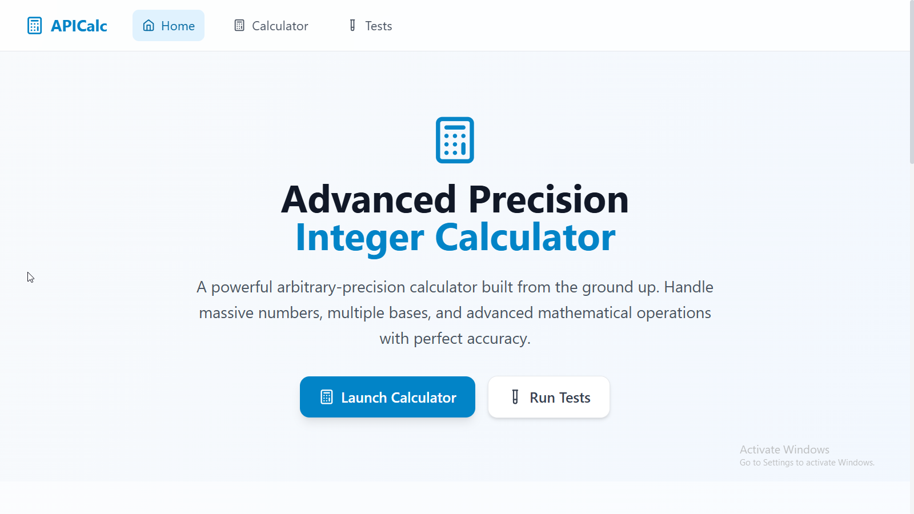
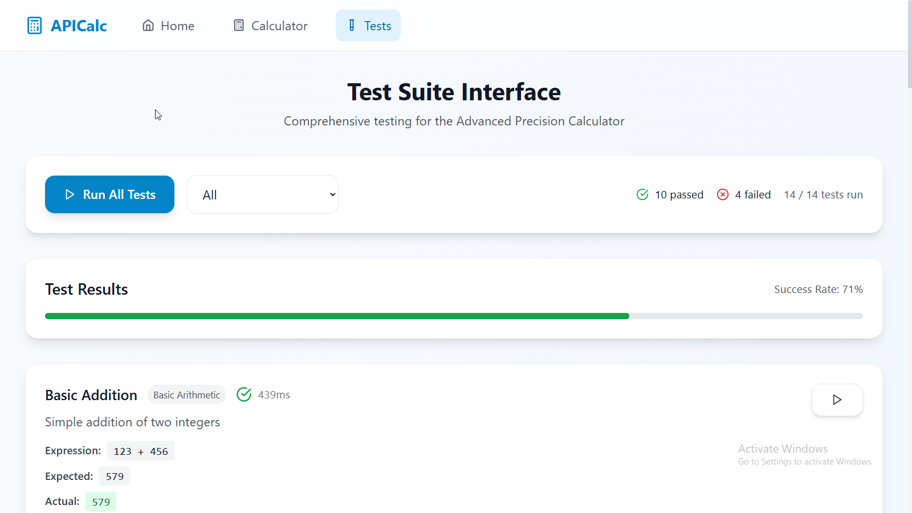

# Advanced Precision Integer Calculator

## Problem Statement

Write an arbitrary-precision-integer calculator in a language that doesn't have native support and without relying on any libraries for the core functionality. Wrap it in a REPL. It should support at least addition, subtraction, multiplication, division (and modulo), exponentiation and factorial. Bonus points for supporting non-decimal bases, fractions, logarithms, etc.

## Overview

An arbitrary-precision integer calculator implemented in Python without relying on external libraries for core mathematical operations. This calculator supports multiple number bases, advanced mathematical functions, and provides both a comprehensive REPL interface and a modern web-based frontend.

Here's what the dashboard looks like:

Live Link: https://apicalculator-v1.netlify.app/

## Architecture

### Backend (Python)
- **Core Engine**: `APICalc.py` - Pure Python implementation with arbitrary precision
- **REPL Interface**: Command-line interface for direct calculator interaction
- **Test Suite**: `test_APICalc.py` - Comprehensive testing framework

### Frontend (React + TypeScript)
- **Modern Web Interface**: Built with React, TypeScript, and Tailwind CSS
- **Calculator Page**: Interactive calculator with visual button interface
- **Test Interface**: Web-based test runner for validation
- **Responsive Design**: Works seamlessly across desktop and mobile devices

## Features

### Core Arithmetic Operations
- **Addition** (`+`): Add two numbers
- **Subtraction** (`-`): Subtract two numbers  
- **Multiplication** (`*`): Multiply two numbers
- **Division** (`/`): Divide two numbers with arbitrary precision
- **Floor Division** (`//`): Integer division
- **Modulo** (`%`): Remainder operation
- **Exponentiation** (`**`): Raise to power

### Advanced Mathematical Functions
- **Factorial** (`factorial(n)` or `n!`): Calculate factorial
- **Square Root** (`sqrt(n)`): Calculate square root
- **Square** (`sqr(n)`): Calculate square (n²)
- **Cube** (`cube(n)`): Calculate cube (n³)
- **Cube Root** (`cube_root(n)`): Calculate cube root
- **Logarithm** (`log(n)` or `log(n, base)`): Natural or base logarithm
- **Exponential** (`exp(n)`): Calculate e^n
- **Inverse** (`inverse(n)`): Calculate 1/n

### Trigonometric Functions
- **Sine** (`sin(x)`): Calculate sine
- **Cosine** (`cos(x)`): Calculate cosine
- **Tangent** (`tan(x)`): Calculate tangent
- **Arcsine** (`arcsin(x)`): Calculate inverse sine
- **Arccosine** (`arccos(x)`): Calculate inverse cosine
- **Arctangent** (`arctan(x)`): Calculate inverse tangent

### Number Base Support
- **Binary** (`0b1010`): Base-2 numbers
- **Octal** (`0o17`): Base-8 numbers
- **Decimal** (default): Base-10 numbers
- **Hexadecimal** (`0xFF`): Base-16 numbers
- **Custom Bases**: Support for bases 2-36

### Fraction Support
- **Fraction Conversion** (`to_fraction()`): Convert to fraction representation
- **Fraction Input**: Initialize with fraction values
- **Fraction Arithmetic**: Perform operations on fractions

## Usage

### Web Interface

1. **Start the development server:**
   ```bash
   npm run dev
   ```

2. **Navigate to the application:**
   - **Home Page**: Overview and navigation
   - **Calculator**: Interactive calculator interface
   - **Tests**: Web-based test runner

### Command Line Interface

```bash
python APICalc.py
```

### REPL Commands

- `menu` - Show help menu with all available operations
- `history` - Display calculation history (last 10 calculations)
- `clear` - Clear calculation history
- `quit` or `exit` - Exit the calculator

### Example Usage

#### Web Interface
- Use the visual calculator buttons for easy input
- Type expressions directly in the input field
- View calculation history in the sidebar
- Copy results to clipboard with one click

Here's how the calculator looks:


#### Command Line
```
>>> 123 + 456
579

>>> factorial(5)
120

>>> sqrt(16)
4.0

>>> 0b1010 + 0x10
0b11010

>>> sin(3.14159/2)
0.9999999999999999

>>> log(100, 10)
2.0

>>> to_fraction(0.75)
3/4
```

### Advanced Examples

```
>>> 2 ** 100
1267650600228229401496703205376

>>> factorial(20)
2432902008176640000

>>> 0xFF * 0b1010
0xa0a

>>> sqrt(2) ** 2
2.0000000000000004
```

## Implementation Details

### Precision Modes
- **Standard**: 50 digits precision (default)
- **High**: 200 digits precision
- **Extreme**: 1000 digits precision

### Algorithms Used
- **Karatsuba Multiplication**: For large number multiplication
- **Newton-Raphson Method**: For division and square root
- **Binary Exponentiation**: For efficient power calculation
- **Long Division**: For precise division operations

### Error Handling
- Division by zero protection
- Invalid input validation
- Precision loss warnings
- Domain validation for mathematical functions

## Testing

### Web Interface Tests
Access the test interface through the web application to run comprehensive test suites with visual feedback.

### Command Line Tests
```bash
python test_APICalc.py
```

The test suite includes:
- Basic arithmetic operations
- Advanced mathematical functions
- Base conversion testing
- Error handling validation
- Precision testing
- Edge case handling

Test Interface:


Test Results:


## Development Setup

### Prerequisites
- Python 3.6 or higher
- Node.js 16 or higher
- npm or yarn

### Installation

1. **Clone the repository**
2. **Install Python dependencies** (none required for core functionality)
3. **Install Node.js dependencies:**
   ```bash
   npm install
   ```
4. **Start the development server:**
   ```bash
   npm run dev
   ```

### Project Structure

```
├── APICalc.py              # Core Python calculator engine
├── test_APICalc.py         # Python test suite
├── src/
│   ├── components/         # React components
│   ├── pages/             # Application pages
│   ├── App.tsx            # Main React application
│   └── main.tsx           # Application entry point
├── public/                # Static assets
└── package.json           # Node.js dependencies
```

## Architecture

### Core Classes
- `AdvancedPrecisionNumber`: Main number class with arbitrary precision
- `ImprovedTestResult`: Enhanced test result reporting

### Key Methods
- `_parse_input()`: Parse various input formats
- `_base_to_decimal()`: Convert from any base to decimal
- `_decimal_to_base()`: Convert from decimal to any base
- `_standard_multiply()`: Standard multiplication algorithm
- `_karatsuba_multiply()`: Karatsuba multiplication for large numbers
- `_long_division()`: Long division algorithm

## Requirements

### Backend
- Python 3.6 or higher
- No external dependencies for core functionality
- Built-in `fractions` module for fraction support
- Built-in `math` module for some advanced functions

### Frontend
- React 18+
- TypeScript
- Tailwind CSS
- Vite (development server)
- Modern web browser

## License

MIT License - see LICENSE file for details.

## Contributing

1. Fork the repository
2. Create a feature branch
3. Add tests for new functionality
4. Ensure all tests pass (both Python and web interface)
5. Submit a pull request

## Known Limitations

- Trigonometric functions use built-in math library for now
- Very large numbers may cause performance issues
- Some advanced mathematical functions are approximations
- Memory usage grows with precision requirements

## Future Enhancements

- Pure arbitrary precision trigonometric functions
- Complex number support
- Matrix operations
- Symbolic computation features
- Performance optimizations for very large numbers
- Backend API integration for web interface
- Real-time collaboration features
- Export/import calculation sessions
